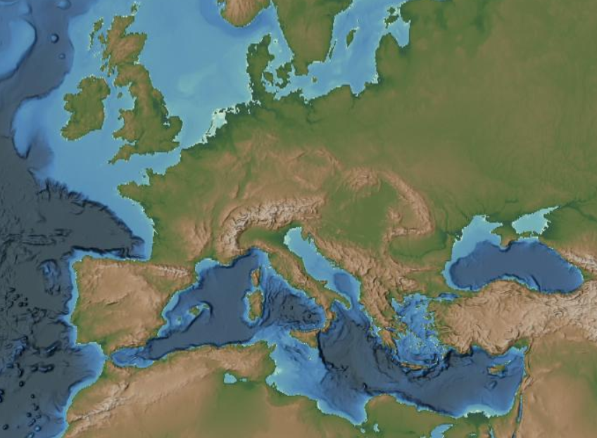
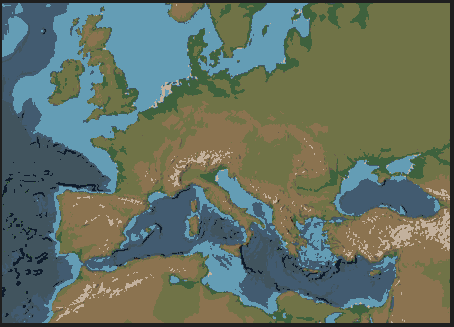
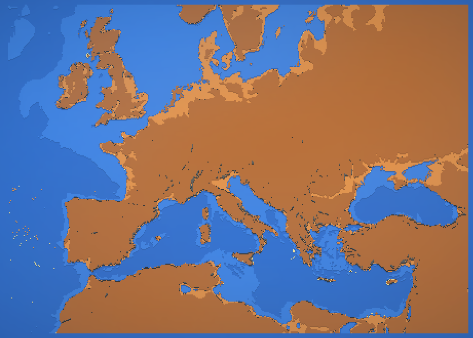

# Img2MapTopo

This tool can be used to grab any image and convert it into a topographic map for the game WorldBox. This project is the result of a lazy Sunday, I hope it becomes useful to someone!

The tool works by specifying the image path, the color to tile mapping, and the width and height of the map you want to generate. The tool then loads in the image, converts it to RGB, and then quantizes all of the colors to the colors that you have mapped. Once that has been done, the tool takes the quantized pixels and maps them against the mapping they were given to create a WorldBox map with different tiles.

I added default color mappings for https://www.ncei.noaa.gov/maps/grid-extract/ using the ETOPO_2022 Hillshade (Ice Surface; 15 arcseconds) setting but you can use any image if you change the pixel mappings. For the noaa.gove site, you can either select an area and download the .tif file or just screenshot the section you care about.

If you want to see the quantized colors before the map is converted then you can set the optional parameter show_image to True.

## Examples



```py
# Change Below Here!!
image_path = 'europe.PNG'

# update the base mapping if you are using a different site
img2map = Img2MapTopo(image_path, BASE_MAPPING, width=7, height=5, show_image=True)

# change the path where you want to save the wbox file
img2map.save("map.wbox")
```

The quantized image is:



When loaded in WorldBox we then get:


